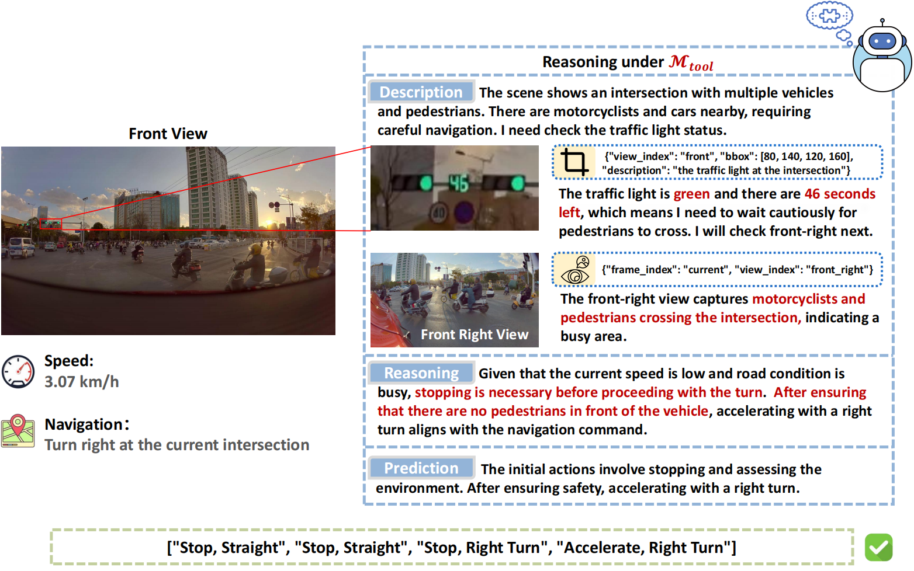

# DriveAgent-R1: Advancing VLM-based Autonomous Driving with Active Perception and Hybrid Thinking

[](https://iclr.cc/)

**Accepted to ICLR 2026**

---

This is the official repository for **DriveAgent-R1**. We introduce an autonomous driving agent that pioneers **active perception** and a **hybrid-thinking framework** for high-level behavioral planning.

At its core, `DriveAgent-R1` is designed to mimic human-like cognitive patterns. Instead of passively processing a fixed set of visual inputs, it can proactively seek crucial visual evidence through a specialized Vision Toolkit when faced with uncertainty. Furthermore, its hybrid-thinking framework allows it to adaptively switch between efficient text-only reasoning for simple scenarios and robust, tool-augmented visual reasoning for complex ones.

Our 3B parameter model achieves performance competitive with top-tier systems like GPT-5 and human drivers, while remaining efficient and deployment-friendly.

## Core Concepts

**1. Active Perception for Grounded Reasoning**

In complex scenarios, `DriveAgent-R1` proactively uses tools like **RoI Inspection** to clarify uncertainty. This grounds its decisions in verifiable visual evidence, enhancing reliability and interpretability.

<p align="center">
  
</p>
<p align="center">
  <em>The agent actively inspects a confusing scene to discover a minor collision, leading to a safe plan to stop.</em>
</p>

**2. Hybrid-Thinking Framework**

`DriveAgent-R1` dynamically adapts its reasoning mode based on scene complexity, balancing computational efficiency with robust, in-depth analysis.

<p align="center">
  
</p>
<p align="center">
  <em>For simple cases, it uses text-based reasoning. For complex cases, it interleaves thoughts with tool calls to acquire new visual evidence.</em>
</p>

## Releases

We have released the **Training Code** for DriveAgent-R1, including the complete source code for all training stages with multi-round tool calling framework.

### Released
-   [x] **Training Code**: The complete source code for all training stages, including Supervised Fine-Tuning (SFT) and Cascaded Reinforcement Learning (Cascaded RL). See [Installation](#installation) and [Project Structure](#project-structure) for details.

### Upcoming Releases

To support full reproducibility and empower future research in the community, we are committed to releasing the following assets:

-   [ ] **Evaluation Scripts**: The full scripts to reproduce the benchmark results reported in our paper.

-   [ ] **Datasets**
    -   [ ] **Drive-Internal Dataset**: The complete dataset, including training and test splits with all corresponding meta-action labels.
    -   [ ] **nuScenes Test Set**: Our specific test split and the generated meta-action labels.

-   [ ] **Models**
    -   [ ] **Trained Model Weights**: Model checkpoint of `DriveAgent-R1` to allow for direct inference and replication of our results.

## Installation

This project integrates [DetAny3D](https://github.com/opendrivelab/DetAny3D) for 3D object detection and [Depth-Anything-V2](https://github.com/DepthAnything/Depth-Anything-V2) for depth estimation. Please follow the installation instructions below.

### Prerequisites

- Python 3.12
- CUDA 12.0+ 
- Ubuntu

### Step 1: Install DetAny3D

Follow the official [DetAny3D](https://github.com/opendrivelab/DetAny3D) installation instructions to set up the environment. Download the required checkpoints and place them in the `DetAny3D/checkpoints/` directory.

**Important**: Before training or inference, you need to start the 3D detection server in a separate terminal:

```bash
cd DetAny3D
bash start_server.sh
```

### Step 2: Install Depth-Anything-V2

Follow the official [Depth-Anything-V2](https://github.com/DepthAnything/Depth-Anything-V2) installation instructions to set up the environment. Download the model weight `depth_anything_v2_vitl.pth` and place it in the `tool-rl/Depth-Anything-V2/checkpoints/` directory.

**Note**: The weight file used in this project is `depth_anything_v2_vitl.pth` (Depth-Anything-V2-Large model).

You can download the checkpoint from:
- [Hugging Face](https://huggingface.co/depth-anything/Depth-Anything-V2-Large/resolve/main/depth_anything_v2_vitl.pth)

### Step 3: Install DriveAgent-R1

```bash
cd tool-rl
pip install -e .
```

This will install the training framework and all necessary dependencies.

## Project Structure

The key components of the training codebase are organized as follows:

- **Tool Library**: `tool-rl/src/r1-v/src/open_r1/tools`
  - Contains all vision tools including 3D object detection, depth estimation, RoI inspection, etc.

- **Training Scripts**: `tool-rl/src/scripts`

- **Multi-round Tool Calling Training Framework**: `tool-rl/src/r1-v/src/open_r1/trainer/vllm_grpo_trainer_modified.py`
  - The core training framework that supports multi-round tool calling with GRPO (Group Relative Policy Optimization)

## Showcase:

Here are some qualitative examples illustrating `DriveAgent-R1`'s capabilities in diverse driving scenarios.

### Routine Scenarios: Text-based Reasoning ($\mathcal{M}_{\text{text}}$)

For common, low-complexity situations, `DriveAgent-R1` defaults to its efficient text-only reasoning mode.

**Case 1: Navigating a Toll Booth**
<p align="center">
  
</p>
<p align="center">
  <em>In a routine scenario approaching a toll booth, <code>DriveAgent-R1</code> recognizes the low complexity and lack of ambiguity. It employs its efficient text-only mode to formulate a safe plan: decelerate to pass through the gate, then maintain speed to proceed.</em>
</p>

**Case 2: Driving on an Open Road**
<p align="center">
  
</p>
<p align="center">
  <em>With a straight road and an open view, the agent defaults to text-only reasoning due to the low scene complexity[cite: 429]. It accurately assesses the simple conditions and plans to "Keep Speed, Continue Straight" without invoking its vision toolkit, demonstrating the efficiency of the hybrid framework.</em>
</p>

### Complex Scenarios: Active Perception with Vision Toolkit ($\mathcal{M}_{\text{tool}}$)

In complex or uncertain environments, `DriveAgent-R1` proactively invokes its Vision Toolkit to gather crucial evidence and ground its decisions.

**Case 3: Navigating a Busy Intersection**
<p align="center">
  
</p>
<p align="center">
  <em>Facing a busy intersection with heavy traffic, the initial view is insufficient to determine the traffic light's status. The agent uses <strong>RoI Inspection</strong> to confirm the green light and <strong>Retrieve View</strong> to assess the dense flow of crossing traffic. This evidence allows it to formulate a safe plan: stop and wait for pedestrians to clear before turning.</em>
</p>

**Case 4: Uncovering Hazards at Night**
<p align="center">
  
</p>
<p align="center">
  <em>While navigating a narrow road at night, the initial perception fails to detect a pedestrian in the dark. By invoking the <strong>3D Object Detection</strong> tool, the agent performs active perception and successfully identifies the overlooked pedestrian, prompting it to decelerate in response to the newly revealed risk.</em>
</p>

**Case 5: Passing a Barrier with Depth Awareness**
<p align="center">
  
</p>
<p align="center">
  <em>When precise distance judgment is needed, such as passing a barrier, the <strong>Depth Estimation</strong> tool proves invaluable. The depth map confirms the gate's proximity while also revealing the open road beyond, allowing the agent to formulate a multi-stage plan: slow down for the obstacle, then accelerate once safely through.</em>
</p>

**Case 6: Assessing Distant Pedestrian Risk**
<p align="center">
  
</p>
<p align="center">
  <em>Even on a seemingly clear road, the agent exhibits proactive caution by investigating distant pedestrians whose proximity to the road is uncertain[cite: 439]. It deploys <strong>RoI Inspection</strong> to get a magnified view, revealing that the individuals are very close to the lane of travel. This insight elevates the potential risk, prompting a prudent decision to decelerate.</em>
</p>

## Citation

If you find this work useful, please consider citing:

```bibtex
@inproceedings{driveagentr1,
  title={DriveAgent-R1: Advancing VLM-based Autonomous Driving with Active Perception and Hybrid Thinking},
  author={Weicheng Zheng, Xiaofei Mao, Nanfei Ye, Pengxiang Li, Kun Zhan, XianPeng Lang, Hang Zhao},
  booktitle={International Conference on Learning Representations (ICLR)},
  year={2026}
}
```

## Acknowledgements

This project is built upon [R1-V](https://github.com/Deep-Agent/R1-V), a powerful framework for reinforcement learning in vision-language models. We sincerely thank the following open-source projects and communities:

- **[R1-V](https://github.com/Deep-Agent/R1-V)**: The foundation framework for our training infrastructure
- **[DetAny3D](https://github.com/opendrivelab/DetAny3D)**: 3D object detection capabilities
- **[Depth-Anything-V2](https://github.com/DepthAnything/Depth-Anything-V2)**: Depth estimation model
- **[Qwen-VL](https://github.com/QwenLM/Qwen2.5-VL)**: Vision-language model backbone

We are grateful for their excellent work and contributions to the open-source community.
