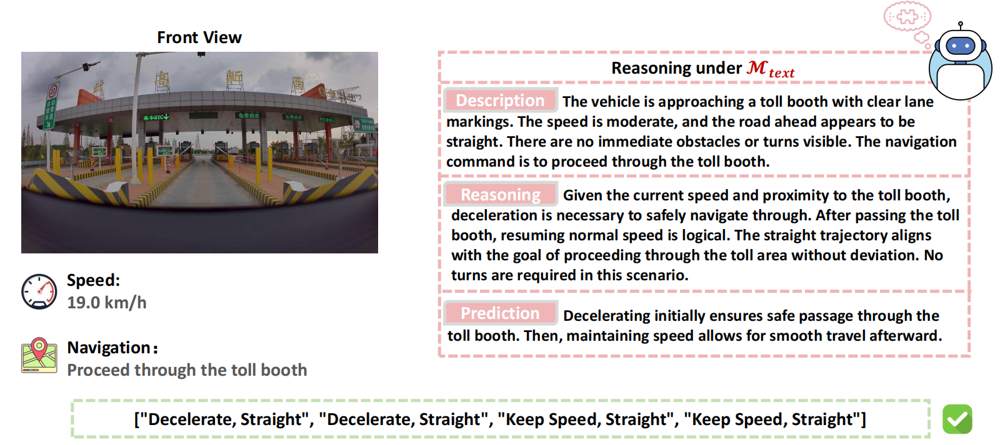
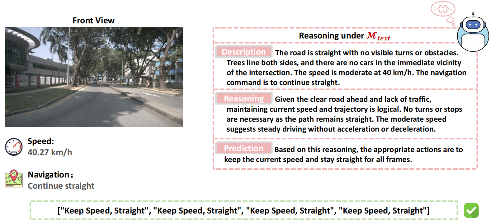
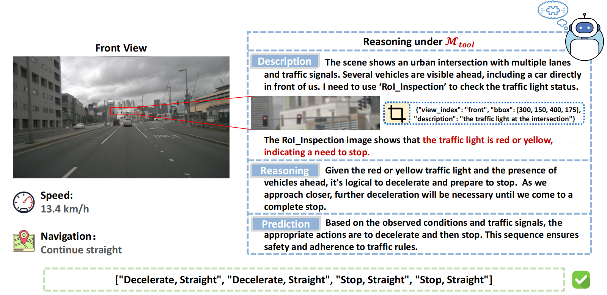
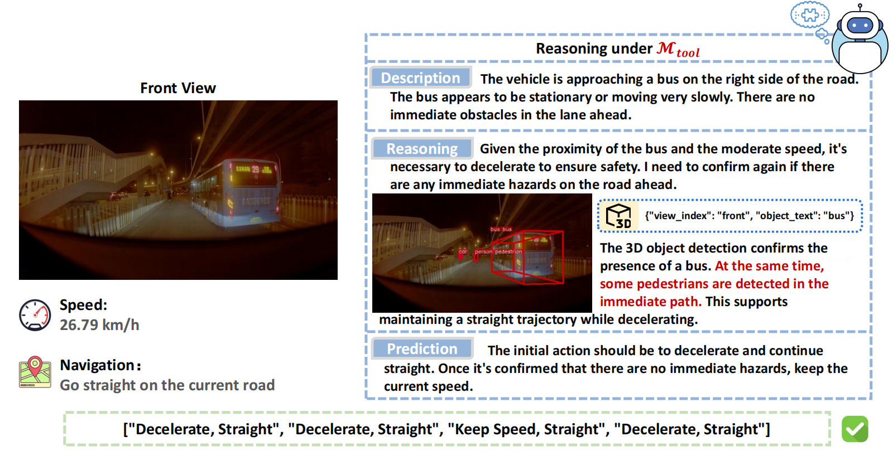
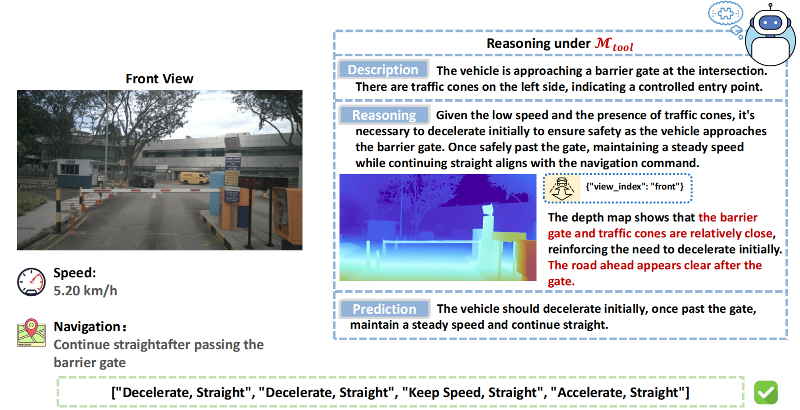
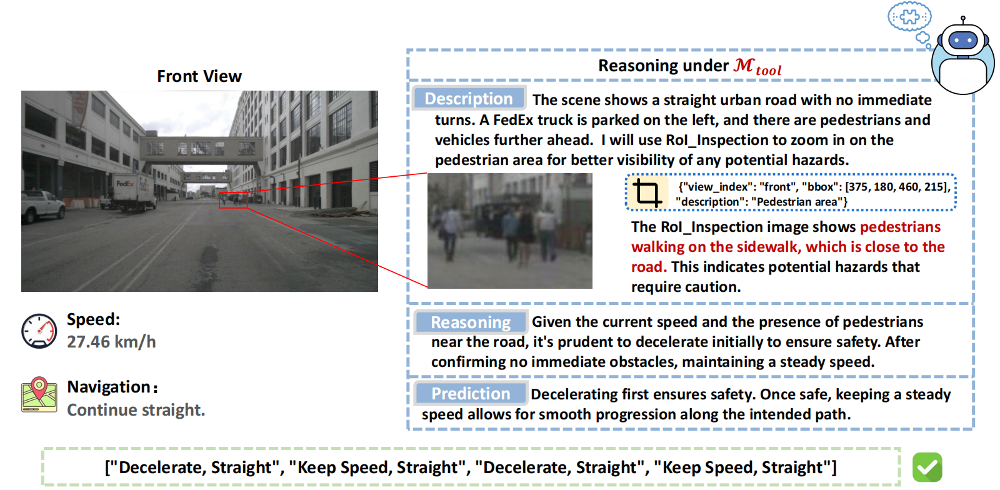

# DriveAgent-R1: Advancing VLM-based Autonomous Driving with Active Perception and Hybrid Thinking

**[<a href="https://arxiv.org/abs/2507.20879" target="_blank">arXiv Paper</a>]**

---

This is the official repository for **DriveAgent-R1**. We introduce an autonomous driving agent that pioneers **active perception** and a **hybrid-thinking framework** for high-level behavioral planning.

At its core, `DriveAgent-R1` is designed to mimic human-like cognitive patterns. Instead of passively processing a fixed set of visual inputs, it can proactively seek crucial visual evidence through a specialized Vision Toolkit when faced with uncertainty. Furthermore, its hybrid-thinking framework allows it to adaptively switch between efficient text-only reasoning for simple scenarios and robust, tool-augmented visual reasoning for complex ones.

Our 3B parameter model achieves performance competitive with top-tier systems like GPT-5 and human drivers, while remaining efficient and deployment-friendly.

### Core Concepts

**1. Active Perception for Grounded Reasoning**

In complex scenarios, `DriveAgent-R1` proactively uses tools like **RoI Inspection** to clarify uncertainty. This grounds its decisions in verifiable visual evidence, enhancing reliability and interpretability.

  

  <em>The agent actively inspects a confusing scene to discover a minor collision, leading to a safe plan to stop.</em>

**2. Hybrid-Thinking Framework**

`DriveAgent-R1` dynamically adapts its reasoning mode based on scene complexity, balancing computational efficiency with robust, in-depth analysis.

  

  <em>For simple cases, it uses text-based reasoning. For complex cases, it interleaves thoughts with tool calls to acquire new visual evidence.</em>

## Showcase: Reasoning in Action

Here are some qualitative examples illustrating `DriveAgent-R1`'s capabilities in diverse driving scenarios.

### Routine Scenarios: Text-based Reasoning ($\mathcal{M}_{\text{text}}$)

For common, low-complexity situations, `DriveAgent-R1` defaults to its efficient text-only reasoning mode.

**Case 1: Navigating a Toll Booth**

  

  <em>In a routine scenario approaching a toll booth, <code>DriveAgent-R1</code> recognizes the low complexity and lack of ambiguity[cite: 427]. It employs its efficient text-only mode to formulate a safe plan: decelerate to pass through the gate, then maintain speed to proceed.</em>

**Case 2: Driving on an Open Road**

  

  <em>With a straight road and an open view, the agent defaults to text-only reasoning due to the low scene complexity[cite: 429]. It accurately assesses the simple conditions and plans to "Keep Speed, Continue Straight" without invoking its vision toolkit, demonstrating the efficiency of the hybrid framework[cite: 430].</em>

### Complex Scenarios: Active Perception with Vision Toolkit ($\mathcal{M}_{\text{tool}}$)

In complex or uncertain environments, `DriveAgent-R1` proactively invokes its Vision Toolkit to gather crucial evidence and ground its decisions.

**Case 3: Discovering a Minor Collision**

  

  <em>The agent proactively uses the <strong>RoI Inspection</strong> tool to clarify an uncertain scene, discovering a minor collision between the vehicles ahead[cite: 30]. This active perception corrects its initial assessment, leading to a safe plan to decelerate and then stop based on direct visual evidence[cite: 30].</em>

**Case 4: Navigating a Busy Intersection**

  

  <em>Facing a busy intersection with heavy traffic, the initial view is insufficient to determine the traffic light's status[cite: 431]. The agent uses <strong>RoI Inspection</strong> to confirm the green light and <strong>Retrieve View</strong> to assess the dense flow of crossing traffic[cite: 432]. This evidence allows it to formulate a safe plan: stop and wait for pedestrians to clear before turning[cite: 433].</em>

**Case 5: Uncovering Hazards at Night**

  

  <em>While navigating a narrow road at night, the initial perception fails to detect a pedestrian in the dark[cite: 434]. By invoking the <strong>3D Object Detection</strong> tool, the agent performs active perception and successfully identifies the overlooked pedestrian, prompting it to decelerate in response to the newly revealed risk[cite: 435].</em>

**Case 6: Passing a Barrier with Depth Awareness**

  

  <em>When precise distance judgment is needed, such as passing a barrier, the <strong>Depth Estimation</strong> tool proves invaluable[cite: 436]. The depth map confirms the gate's proximity while also revealing the open road beyond, allowing the agent to formulate a multi-stage plan: slow down for the obstacle, then accelerate once safely through[cite: 437, 438].</em>

**Case 7: Assessing Distant Pedestrian Risk**

  

  <em>Even on a seemingly clear road, the agent exhibits proactive caution by investigating distant pedestrians whose proximity to the road is uncertain[cite: 439]. It deploys <strong>RoI Inspection</strong> to get a magnified view, revealing that the individuals are very close to the lane of travel[cite: 440]. This insight elevates the potential risk, prompting a prudent decision to decelerate[cite: 440].</em>

### Upcoming Releases

To support reproducibility and further research in the community, we are committed to releasing the following assets after the peer-review process:

-   ✅ **Test Data Splits**: The complete test splits for both **Drive-Internaltest** and **nuScenestest** will be made public.
-   ✅ **Meta-Action Labels**: The generated meta-action labels for both test sets.
-   ✅ **Evaluation Scripts**: The full evaluation scripts to allow for fair and consistent benchmarking against our results.

Due to enterprise confidentiality requirements, we are unable to release our training code and the full Drive-Internal training dataset.

---
*Note: Please create a `figs` folder in your repository and upload the `example.png` and `arc.png` images for the README to display them correctly. You will also need to update the placeholder links for the Project Page and arXiv paper.*
