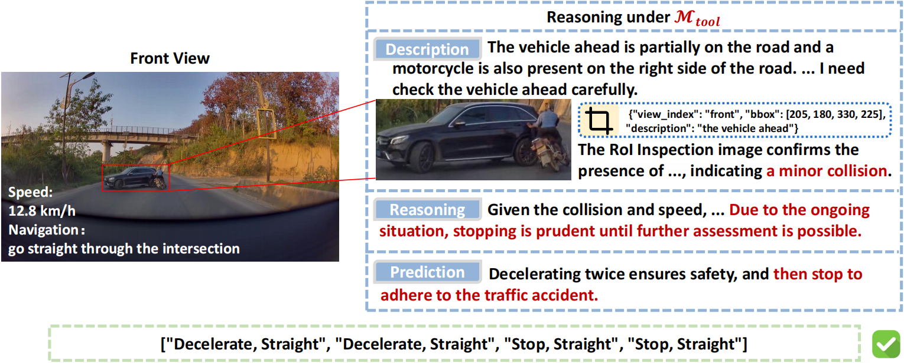
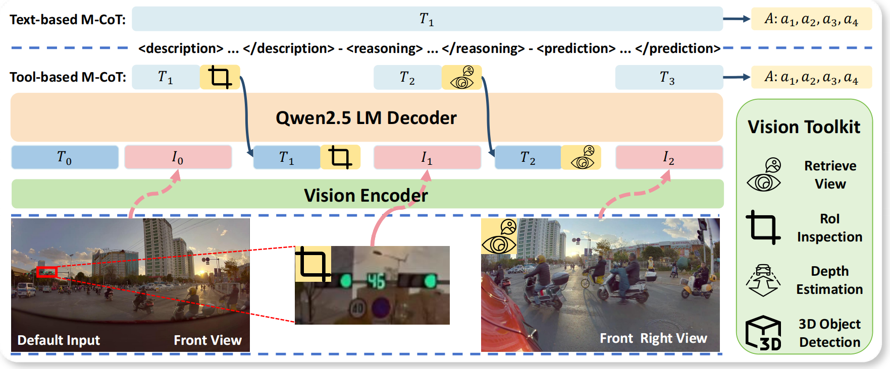

# DriveAgent-R1: Advancing VLM-based Autonomous Driving with Active Perception and Hybrid Thinking

**[<a href="https://arxiv.org/abs/2507.20879" target="_blank">arXiv Paper</a>]**

---

This is the official repository for **DriveAgent-R1**. We introduce an autonomous driving agent that pioneers **active perception** and a **hybrid-thinking framework** for high-level behavioral planning.

At its core, `DriveAgent-R1` is designed to mimic human-like cognitive patterns. Instead of passively processing a fixed set of visual inputs, it can proactively seek crucial visual evidence through a specialized Vision Toolkit when faced with uncertainty. Furthermore, its hybrid-thinking framework allows it to adaptively switch between efficient text-only reasoning for simple scenarios and robust, tool-augmented visual reasoning for complex ones.

Our 3B parameter model achieves performance competitive with top-tier systems like GPT-5 and human drivers, while remaining efficient and deployment-friendly.

### Core Concepts

**1. Active Perception for Grounded Reasoning**

In complex scenarios, `DriveAgent-R1` proactively uses tools like **RoI Inspection** to clarify uncertainty. This grounds its decisions in verifiable visual evidence, enhancing reliability and interpretability.

  

  <em>The agent actively inspects a confusing scene to discover a minor collision, leading to a safe plan to stop.</em>

**2. Hybrid-Thinking Framework**

`DriveAgent-R1` dynamically adapts its reasoning mode based on scene complexity, balancing computational efficiency with robust, in-depth analysis.

  

  <em>For simple cases, it uses text-based reasoning. For complex cases, it interleaves thoughts with tool calls to acquire new visual evidence.</em>

### Upcoming Releases

To support reproducibility and further research in the community, we are committed to releasing the following assets after the peer-review process:

-   ✅ **Test Data Splits**: The complete test splits for both **Drive-Internaltest** and **nuScenestest** will be made public.
-   ✅ **Meta-Action Labels**: The generated meta-action labels for both test sets.
-   ✅ **Evaluation Scripts**: The full evaluation scripts to allow for fair and consistent benchmarking against our results.

Due to enterprise confidentiality requirements, we are unable to release our training code and the full Drive-Internal training dataset.

---
*Note: Please create a `figs` folder in your repository and upload the `example.png` and `arc.png` images for the README to display them correctly. You will also need to update the placeholder links for the Project Page and arXiv paper.*
